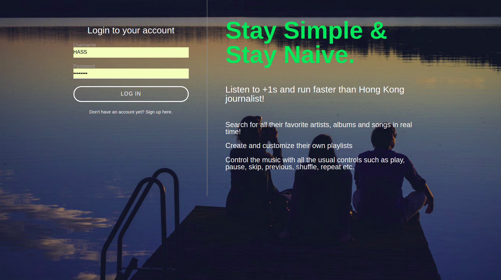
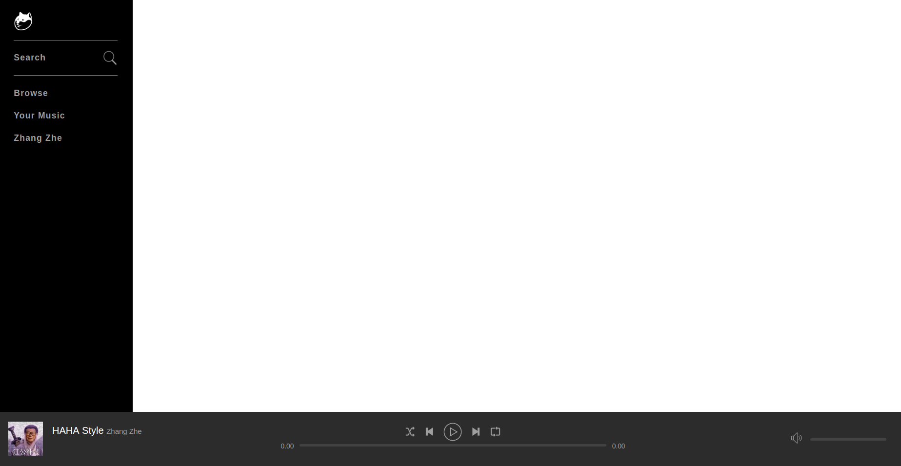
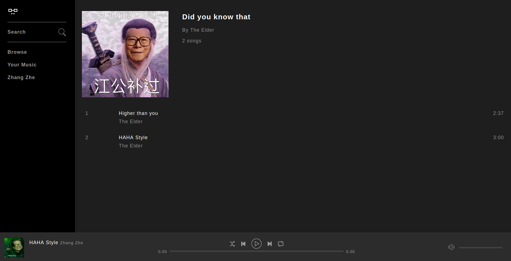

# +1 s
This project uses HTML, CSS, PHP, JQuery, JavaScript and MySQL to build a complete Spotify clone(without ad XD).

Users will be able to: 

- Sign up
- Search for all their favorite artists, albums and songs in real time!
- Create and customize their own playlists
- Control the music with all the usual controls such as play, pause, skip, previous, shuffle, repeat etc.

Login & Register page:

You Might Like page (default home page):

Album page:

